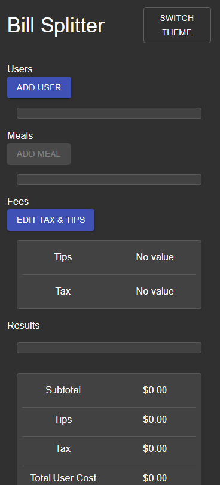

# Bill Splitter

## Background

---

### What is it?

- This is a React app that calculates how much each person should pay when splitting a bill.
  - According to what each person ordered and consumed, the app will calculate a portion of the bill everyone should pay.
- Users can input people's names, meals ordered, tips percentage, and tax.

- This is based on a rough version that I wrote back in Sept 2020.
  - Link to the [old version](https://github.com/sofia819/bill-splitter-old)

### Why did you write this app?

- Every time I go out with my friends, we always spend a lot of time remembering what we each ordered and shared and attempt to calculate how much each person should pay.
- I created this app because I hope to lessen the time we spend on that process.
- I also wanted to take the chance to learn how to use TypeScript and React Context.

## How do I use it?

---

- The app is available here: https://bill-price-splitter.herokuapp.com/.

### Users

---

#### Adding Users

- Click on the `Add User` button and a modal will open, allowing the user to input information for a user.
- The user must enter a name to add a new user.

#### Editing Users

- Click on the `Edit` button next to the user that you would like to edit and a modal will open, allowing the user to change the information.
- The user must enter a name to save.

#### Removing Users

- Click on the `Del` button next to the user that you would like to remove.
- A user cannot be deleted if he or she has one or more meals.

### Meals

---

#### Adding Meals

- Click on the `Add Meal` button and a modal will open, allowing the user to input information for a meal.
- The user must enter a name, a price, a quantity of at least 1, and select at least one user who has consumed the meal to add a new meal.
- You must have at least one user in the user list to add a meal.

#### Editing Meals

- Click on the `Edit` button next to the meal that you would like to edit and a modal will open, allowing the user to change the information.
- The user must enter a name, a price, a quantity of at least 1, and select at least one user who has consumed the meal to save.

#### Removing Meals

- Click on the `Del` button next to the meal that you would like to remove.

### Fees

---

#### Editing Tax and Tips

- Click on `Edit Tax & Tips` and a modal will open, allowing the user to input the tip percentage and tax included in the bill.

### Results

---

### Viewing Results

- After you have input all the information from your bill, scroll to the bottom and view the results!

## Notes

---

- This is a work in progress and bugs will exist.
- As I use the app more, I will try to improve the app and fix the bugs.

## Available Scripts

---

In the project directory, you can run:

### `npm start`

Runs the app in the development mode.\
Open [http://localhost:3000](http://localhost:3000) to view it in the browser.

The page will reload if you make edits.\
You will also see any lint errors in the console.
